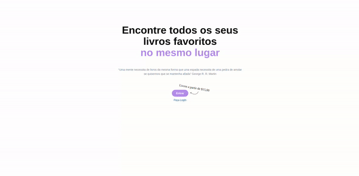

### Book's Yas

## Descrição do projeto

Book'Yas foi um projeto desenvolvido que tinha como objetivo construir uma pagina de e-commerce, onde por meio de providers com contexApi deveriamos renderizar os produtos na tela (responsiva e mobile first), seguindo o figma base criado por mim! Possui tela de login e cadastro, homePage, page principal e page carrinho onde é renderizado a quantiade de itens adicionados e contabilizado o valor total

## Principais desafios

Foi o meu primeiro projeto de e-commerce em React com uso de contextApi, nele treinei os providers pela primeira vez ! Foi um ótimo aprendizado.

## Principais Técnologias Usadas

- ChakraUi
- ContextApi
- ReactJs
- JavaScript
- CSS 
- HTML

## Como Acessar o Projeto: 

https://yasbooks-yasminalves16.vercel.app/